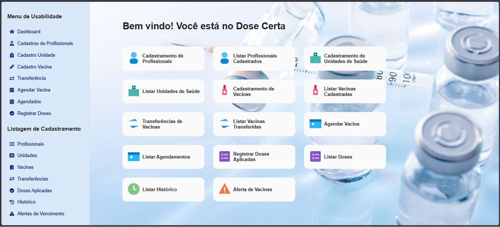

# DoseCerta API

API backend do projeto **DoseCerta**, desenvolvida em **Node.js** com **Express**, banco de dados **MySQL** e **Knex.js** para migrations e seeds. O projeto segue uma arquitetura organizada em **controllers**, **services** e **routes**, com documentação via **Swagger**.

---

## Tecnologias utilizadas

* Node.js
* Express
* MySQL
* Knex.js
* Swagger (swagger-ui-express / swagger-jsdoc)
* Nodemon
* Dotenv
* CORS


## Inicialização do projeto

### 1️⃣ Criar o projeto Node.js

```bash
npm init
```


## Instalação de dependências

### Dependências principais

```bash
npm install express
npm install cors dotenv
```

### Dependências de desenvolvimento

```bash
npm install --save-dev nodemon
```

### Documentação da API (Swagger)

```bash
npm install swagger-ui-express swagger-jsdoc
```

---

## ▶️ Executar o projeto

### Modo desenvolvimento

```bash
npm run dev
```

Após iniciar, a API estará disponível em:

```
http://localhost:3001
```

### Documentação Swagger

```
http://localhost:3001/api-docs
```

---

## Banco de dados (Knex)

### Instalação do Banco de Dados MySQL

```bash
npm install knex mysql2
npm install --save-dev knex
```

### Rodar migrations

```bash
npx knex migrate:latest
```

### Script de teste de migrations

```bash
npm run migrate
```

### Rodar seeds

```bash
npm run seed
```

---

##  Interface da Aplicação

<p align="center">
  
</p>

---

##  Lições aprendidas

Durante o desenvolvimento deste projeto, foram trabalhadas e aprimoradas as seguintes competências:

* **Liderança**: organização das tarefas e tomada de decisões técnicas ao longo do desenvolvimento.
* **Resolução de problemas**: identificação e correção de erros no backend, como tratamento de datas, chaves estrangeiras e status HTTP adequados.
* **Gerenciamento de tempo**: planejamento das etapas do projeto, conciliando desenvolvimento, testes e documentação.

---

##  Importância da aplicação

O sistema **DoseCerta** contribui para a **otimização do controle de vacinas**, permitindo:

* Melhor rastreabilidade de vacinas
* Controle eficiente de transferências entre unidades
* Redução de perdas por vencimento
* Apoio à tomada de decisão na área da saúde

---


